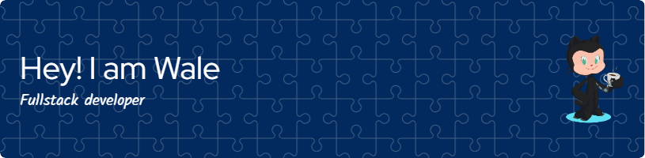

<h1 align="center">Hi 👋, I'm Wale</h1>
<h3 align="center">A passionate full stack developer</h3>

- 🔭 I’m currently working on **a microservice application**

- 🌱 I’m currently learning **Systems Designs**

- 👯 I’m looking to collaborate on **.Net, django, Angular projects**

- 📝 I write and publish C#, .Net, and Angular articles on [medium](https://medium.com/@onafesowale)

- 💬 Ask me about **C#, .Net, Angular**

- 📫 How to reach me **onafesowale@gmail.com**

- ⚡ Fun fact:  **When I was a lot younger, I never liked programming, well, look at where we are now...**

<h3 align="left">Connect with me:</h3>

## 💻 Tech Stack:
              

&nbsp;

